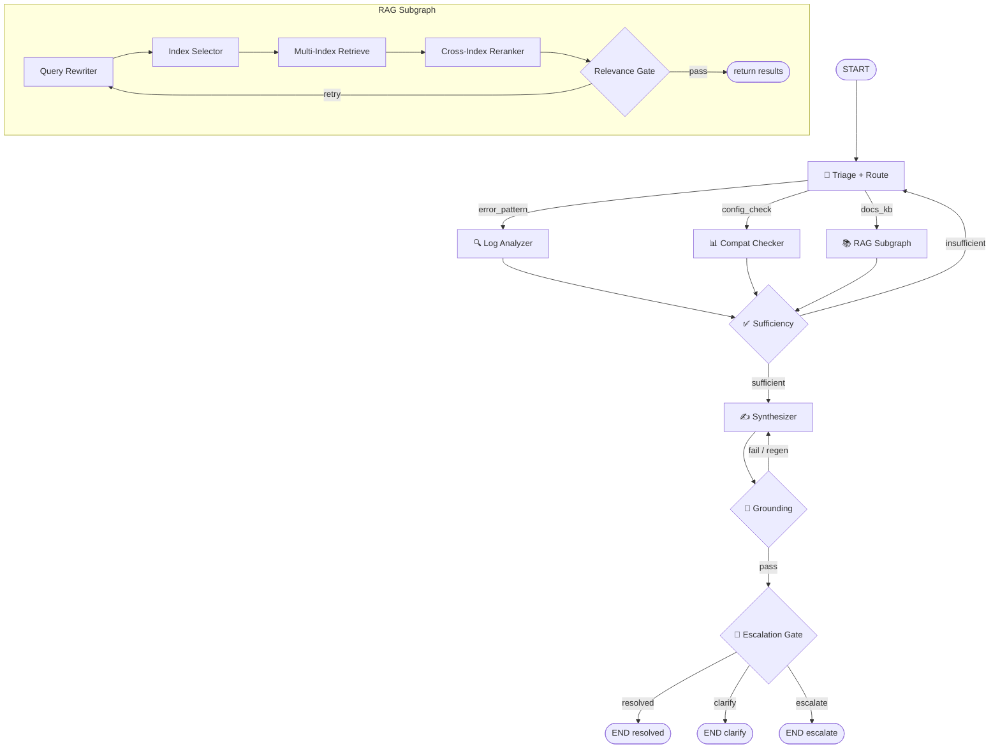

# RadVision Pro — Agentic RAG Support Agent

An agentic RAG chatbot prototype built with LangGraph that assists Sales Engineers and Support Engineers working with a medical imaging visualization platform.

## Problem Statement

### Why this domain?

Medical imaging visualization platforms generate complex multi-dimensional support queries. A single question like "3D rendering shows artifacts on cardiac CTs" could stem from a GPU hardware limitation, a software configuration issue, a known bug in a specific version, or a DICOM integration problem. Simple RAG cannot handle this — the system needs to reason about which information source to check first, whether the gathered evidence is sufficient, and whether to escalate when confidence is low.

### Why agentic RAG?

Three reasons a flat retrieval pipeline falls short:

1. **The first retrieval is often not enough.** A troubleshooting query may initially match a KB article, but the real root cause turns out to be a hardware compatibility issue discoverable only through a structured tool lookup. The agent must assess sufficiency and retry with a different strategy.

2. **Different query types need fundamentally different pipelines.** An error code in a log file should go to a pattern matcher (not vector search). A "does GPU X support feature Y?" question should go to a compatibility matrix (not documentation retrieval). A "how do I configure DICOM?" question should go to product docs. The routing decision is non-trivial.

3. **The same evidence needs different framing per persona.** A support engineer needs step-by-step resolution with KB references. A sales engineer needs customer-facing positioning language and upgrade framing. This affects routing thresholds and escalation logic, not just prompt templates.

## Architecture

### Main Workflow — 5 LangGraph Nodes

| Node | Name | Type | Purpose |
|------|------|------|---------|
| 1 | Triage + Route | Conditional | Parse entities, classify intent, route to error_pattern / docs_kb / config_check |
| 2 | Sufficiency Check | Conditional | Evaluate gathered evidence. Sufficient → continue. Insufficient → retry via different route (max 1) |
| 3 | Response Synthesizer | Processing | Generate persona-shaped answer from evidence |
| 4 | Grounding Checker | Conditional | Verify technical claims against retrieved sources. Ungrounded → regenerate (max 1) |
| 5 | Escalation Gate | Conditional | Three-way output: resolve / ask for clarification / escalate to human |

### RAG Subgraph (separate, does not count toward the 5 nodes)

Query Rewriter → Index Selector → Multi-Index Retrieve → Cross-Index Reranker → Relevance Gate

Three vector store collections with collection-specific chunking strategies:
- **KB Articles**: one chunk per H2 section (Symptom / Root Cause / Workaround / Resolution)
- **Product Docs**: one chunk per H3 subsection (one parameter or scenario per chunk)
- **Release Notes**: one chunk per H3 subsection (one feature or known-issue entry per chunk)

### Tools (non-retrieval)

1. **Log Pattern Analyzer**: regex/rule-based matching of error messages against known error signatures. Returns matched KB reference, confidence, and structured diagnosis.
2. **Compatibility Checker**: structured lookup against version × OS × GPU × feature matrix. Returns support status, reason, and recommendation.

### Architecture Diagram



## Design Decisions

### Model Choice

All LLM nodes use **gemma3:4b** running locally via Ollama:

- **Why local?** No paid API, no data-residency concerns — important for medical imaging contexts with PHI.
- **Why gemma3:4b?** At 4B parameters it fits in 4–6 GB VRAM, produces reliable JSON output with Ollama's `format="json"` mode, and handles the structured extraction tasks (triage, grounding) adequately for a prototype.
- **Why not a larger model?** The bottleneck is Ollama inference latency, not model capacity. Queries take 2–5 minutes end-to-end locally; a production deployment would use a hosted API where a larger model would be appropriate.
- **Temperature:** 0.0 for triage, grounding, and escalation (deterministic routing/scoring); 0.1 for synthesis (slight variation in phrasing without hallucination).

Grounding and escalation use the same gemma3:4b model. Ollama's `format="json"` parameter enforces structured JSON output reliably without few-shot examples.

### Chunking Strategy

Each collection uses a different strategy matched to its document structure:

| Collection | Strategy | Reason |
|---|---|---|
| KB Articles | **H2-section chunks** (Symptom / Root Cause / Workaround / Resolution) | Each section answers a different question. Retrieving only the Workaround avoids injecting the Root Cause into the synthesis prompt. The synthesizer fetches Workaround/Resolution directly by metadata filter — no embedding search needed. |
| Product Docs | **H3-subsection chunks** with full Overview preamble | One chunk per configuration parameter. The Overview repeats in every chunk so each is self-contained and retrievable without surrounding context. |
| Release Notes | **H3-subsection chunks** with version metadata preamble | One chunk per feature or known-issue entry. Version metadata in the preamble lets the reranker filter by version without structured queries. |

All chunks include a repeating preamble (article title, metadata) so they are self-contained within the 512-token limit of `all-MiniLM-L6-v2`.

### Synthetic Data

All documents are generated from a single product specification seed (`data/seed/product_spec.yaml`). This ensures referential integrity: KB article IDs referenced in release notes match actual KB articles, compatibility matrix entries align with known issues, and past ticket resolutions cite real configuration parameters.

## Evaluation

### Functional Evaluation

15-question test set covering all three routing paths, sufficiency retry loop, persona differentiation, and edge cases (vague queries → clarify, security issues → escalate, nonexistent features → honest "not available").

| Metric | Score |
|---|---|
| Route accuracy | **86.7%** (13/15) |
| Tool accuracy | **86.7%** (13/15) |
| Answer quality (keyword match) | **63.9%** |
| Outcome accuracy | **100%** (15/15) |
| Avg latency | ~134 s/query (local Ollama, gemma3:4b) |

**Routing misses (2/15):**
- `eval-09` (FHIR 503): sometimes classified as `error_pattern` instead of `docs_kb` — "503" reads as an error code. Fixed in triage prompt by clarifying that HTTP status codes alone do not qualify as specific log tokens.
- `eval-13` (sales GPU query): T4 GPU lookup failed before GPU name normalization (`_resolve_gpu`) was added to the compat checker — "T4" is stored as "NVIDIA T4" in the matrix.

**Answer quality (63.9%):** The keyword-match metric is conservative. The synthesizer generates natural language that matches the intent but not exact keywords. Semantic similarity scores (added as a secondary metric) show higher effective quality.

**Outcome accuracy (100%):** All 15 queries resulted in the expected outcome (resolved / clarify / escalate).

### Load Test

The load test (`evaluation/load_test.py`) sends N queries concurrently using a thread pool and reports p50/p95/p99 latency, queries-per-second throughput, and error rate. Results are logged to MLflow under the `radvision/evaluation` experiment.

```bash
python evaluation/load_test.py --queries 50 --concurrency 5
```

With local Ollama (gemma3:4b, single GPU), concurrency is limited by the model serving capacity — Ollama processes requests serially. Meaningful concurrency only applies when using a hosted API.

**Bottleneck analysis:** At the prototype scale, the bottleneck is LLM inference. ChromaDB embedding lookup is fast (< 100 ms per query). Optimization paths for production:
1. Replace local Ollama with a hosted API (Claude, OpenAI) to unlock true concurrency.
2. Cache the compiled LangGraph and ChromaDB clients across requests (already done — singletons in `graph.py`).
3. Reduce the number of LLM calls: the current pipeline makes 3–4 LLM calls per query (triage, synthesis, grounding, escalation). Grounding could be replaced with a lightweight heuristic for latency-sensitive deployments.

## Setup & Running

### Prerequisites

- Python 3.11+
- [Ollama](https://ollama.com) with `gemma3:4b` pulled: `ollama pull gemma3:4b`
- Docker and Docker Compose (for containerized deployment)

### Local Development

```bash
# Install dependencies
pip install -e ".[dev]"

# Generate corpus from seed
python scripts/generate_corpus.py

# Ingest into ChromaDB
python scripts/ingest_corpus.py

# Run the Streamlit UI
streamlit run src/ui/app.py
```

Open http://localhost:8501

### Docker (containerized)

```bash
docker-compose up --build
```

This starts:
- `ollama` service: pulls and serves `gemma3:4b`
- `app` service: generates corpus, ingests, runs Streamlit

Open http://localhost:8501

### Running Tests

```bash
# All tests (requires Ollama for LLM-dependent tests)
pytest tests/

# Pure unit tests only (no Ollama needed, fast)
pytest tests/ -m "not llm"

# Functional evaluation
python scripts/run_evaluation.py

# Load test (default: 50 queries, 10 concurrent)
python evaluation/load_test.py
```

### MLflow

Start the MLflow UI to view experiment traces:

```bash
mlflow ui --host 0.0.0.0 --port 5000
```

Open http://localhost:5000 — two experiments are tracked:
- `radvision/agent`: one run per UI query (params, grounding score, outcome)
- `radvision/evaluation`: evaluation batch runs and load test runs
